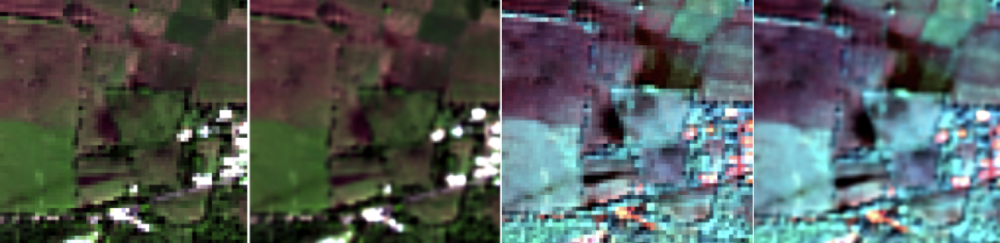
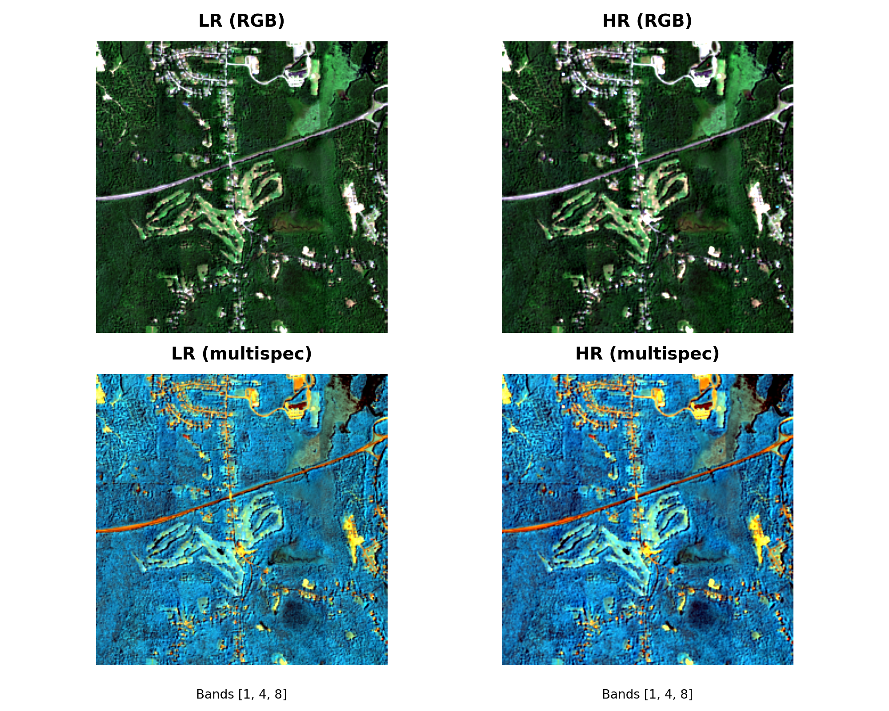

<p align="center">
  
</p>

# SEN2NEON

A PyTorch-based dataset and evaluation framework for the **SEN2NEON** multispectral super-resolution validation dataset.

This repository provides:
- Donwloading functionality for the SEN2NEON-Dataset
- A flexible **Dataset & DataLoader** for SEN2NEON, pairing LR (10 m) and HR (2.5 m) GeoTIFF tiles.
- Landcover classification for the patches
- Visualization helpers (e.g. side-by-side LR/HR samples)
- Inference and metrics calculation
- Integration with:
  - **SEN2NAIP** and **LDSR-S2** models for super-resolution inference.
  - The [**opensr-test**](https://github.com/ESAOpenSR/opensr-test) library for validation metrics and benchmarking.

---


## Quick Start

### Download Dataset
Use the helper script to pull the dataset from the Hugging Face Hub into a local folder (keeps the same layout as on the Hub):
```CLI
python download_data.py --repo-id simon-donike/SEN2NEON --out-dir ./data/sen2neon --use-hf-transfer
```
- This downloads metadata.jsonl, neon_10m_linearized/, neon_2.5m_linearized/, and sen2neon_metadata.csv into ./data/sen2neon.
- The --use-hf-transfer flag enables faster transfers (optional; requires pip install hf_transfer).
- Public datasets don’t need a token. For private repos, set HF_TOKEN in your environment.
- Dataset page: Hugging Face → simon-donike/SEN2NEON

### Dataset
Create Datamodule
```python
from torch.utils.data import DataLoader
from data.sen2neon_ds import SEN2NEON, SEN2NEONDataModule

datamodule = SEN2NEONDataModule(
    lr_dir="/data3/SEN2NEON/processed/neon_10m_linearized",
    hr_dir="/data3/SEN2NEON/processed/neon_2.5m_linearized",
    pattern="*2019-06-15*T1*",
    batch_size=4,
    allow_nan=False,
    pin_memory=True,
)
datamodule.setup(stage="predict") # set up datamodule for prediction
loader = datamodule.predict_dataloader() # get the prediction dataloader
batch = next(iter(loader)) # get a batch from the dataloader
print(batch["lr"].shape, batch["hr"].shape, batch["name"]) # print shapes of lr, hr, and names in the batch
```


Create Pytorch-Lightning Dataset Object
```python
LR_DIR = "/data3/SEN2NEON/processed/neon_10m_linearized"
HR_DIR = "/data3/SEN2NEON/processed/neon_2.5m_linearized"

ds = SEN2NEON(
    LR_DIR, HR_DIR,
    pattern="*.tif",
    crop_size_lr=128,   # None for full images; 128 for aligned LR crops (HR crop auto-scales)
    dtype=torch.float32,
    allow_nan=True
)
```
## Example

Below: SEN2NEON  LR/HR tile pairs, visualized with RGB and multispectral bands.  

<p align="center">
  
</p>

---

### Visualization

```python
# Save a random LR/HR comparison figure
ds.save_example(out_path="example.png")
```

---

### Land-cover Integration

We attach land-cover context to every sample so you can stratify results and metrics by environment type.

- Source: Land-cover labels are derived from an external categorical land-cover raster covering the study area (e.g., national/regional LC map). For each LR patch footprint, we reproject the bounds to the LC raster’s CRS and take the mode (most frequent class) over that window.

- What’s stored (in `sen2neon_metadata.csv` and mirrored in `metadata.jsonl`):
  - LC_detail_id -> numeric code of the fine class (e.g., 41 = Deciduous Forest).
  - LC_detail_text -> human-readable fine class label (e.g., "Deciduous").
  - LC_superclass_id -> numeric code of a coarser super-group (e.g., 40 = Forest, 50 = Built-up).
  - LC_superclass_text -> human-readable super-group label (e.g., "Forest", "Built-up").
  - lon, lat -> centroid in WGS84 for quick mapping/filtering.

- Why this helps:
  - Stratify metrics (PSNR/SSIM/spectral/etc.) by LC_superclass_text or LC_detail_text (e.g., compare performance in Forest vs Built-up).
  - Enable balanced evaluation/sampling by land-cover category.
  - Map/visualize geographic distribution of classes via lon/lat.

- Notes:
  - Some rows may have missing LC values if the footprint falls outside valid LC coverage (like Alaska, Hawaii and Puerto Rico) or into NoData; those appear as null in JSON / empty in CSV.
  - The class mapping (detail <-> super-group <-> text) comes from the LC legend used during preprocessing and is already normalized into the fields above—no extra joins needed.


---

## Roadmap

- [x] Dataset & DataLoader for SEN2NEON
- [x] Land-cover annotation + legend integration
- [x] Example visualization
- [ ] Integrate **SEN2NAIP** and **LDSR-S2** models
- [ ] Run super-resolution validation on SEN2NEON
- [ ] Evaluate metrics with **opensr-test**

