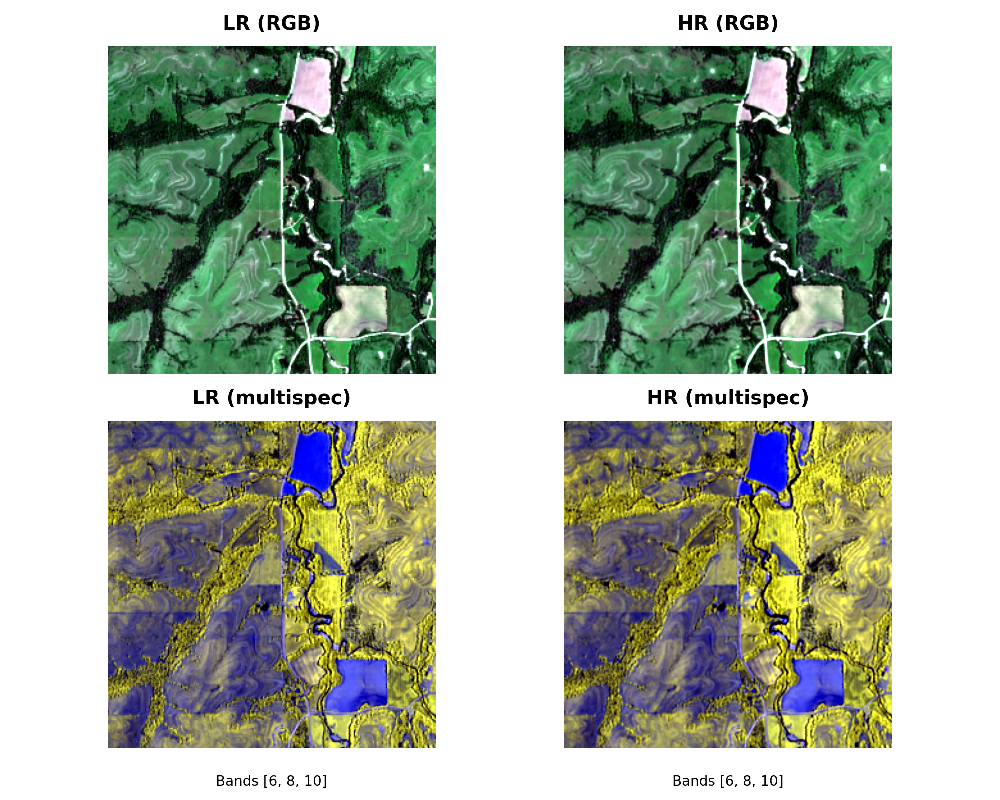

# SEN2NEON

A PyTorch-based dataset and evaluation framework for the **SEN2NEON** multispectral super-resolution validation dataset.

This repository provides:
- A flexible **Dataset & DataLoader** for SEN2NEON, pairing LR (10 m) and HR (2.5 m) GeoTIFF tiles.
- Utilities for **centroid extraction** and **land-cover annotation** (via NLCD/LC maps).
- Visualization helpers (e.g. side-by-side LR/HR samples).
- Planned integration with:
  - **SEN2NAIP** and **LDSR-S2** models for super-resolution inference.
  - The [**opensr-test**](https://github.com/ESAOpenSR/opensr-test) library for validation metrics and benchmarking.

---

## Example

Below: SEN2NEON  LR/HR tile pairs, visualized with RGB and randomly selected bands.  

<p align="center">
  
  
</p>

---


## Quick Start

### Dataset

```python
from torch.utils.data import DataLoader
from sen2neon import SEN2NEON

ds = SEN2NEON(
    lr_dir="/path/to/neon_10m_linearized",
    hr_dir="/path/to/neon_2.5m_linearized",
    pattern="*.tif",
    crop_size_lr=None,
)

loader = DataLoader(ds, batch_size=4, shuffle=True)
batch = next(iter(loader))
print(batch["lr"].shape, batch["hr"].shape, batch["name"])
```

### Land-cover Integration

```python
# Extract centroids
ds.create_csv("centroids.csv")

# Annotate land cover
ds.add_landcover_mode("centroids.csv", "us_LC.tif", "centroids_with_LC.csv")

# Merge LC legend (mapping Number→SuperClass)
ds.clean_landcover_mode("legend.csv")
```

### Visualization

```python
# Save a random LR/HR comparison figure
ds.save_example(out_path="example.png")
```

---

## Roadmap

- [x] Dataset & DataLoader for SEN2NEON
- [x] Land-cover annotation + legend integration
- [x] Example visualization
- [ ] Integrate **SEN2NAIP** and **LDSR-S2** models
- [ ] Run super-resolution validation on SEN2NEON
- [ ] Evaluate metrics with **opensr-test**

---

## License

MIT License. See [LICENSE](LICENSE) for details.
